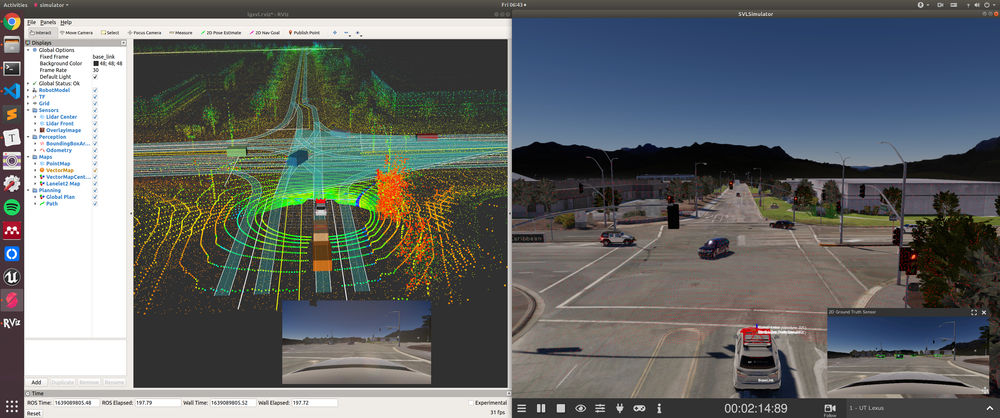

# lgsvl-utils

ROS Helper Nodes for utilising LGSVL Simulator in Autonomous Vehicles Development

[](https://www.codefactor.io/repository/github/ss47816/lgsvl_utils)


## Updates
* [19 Oct 2022] Major refactor of the repo, included minimal required [autoware_ai](https://github.com/autowarefoundation) components so now you can use this repo **out-of-the box**.
## Features
* **Ground Truth Objects**: Convert `lgsvl` 3D ground truth objects to `autoware` and `jsk_recognition` messages and visualize them in Rviz
* **Vehicle Status Publishing**: The ego vehicle's Can Bus data are extracted from the `lgsvl` simulator and published to ROS
* **Map Format Supports**: Support `pointcloud map`, `lanelet2 map`, `vector map` formats
* **Global Planning**: Provide Global Planning in `lanelet2 map` format (Issue discovered, fixing...)
* **Joystick Control**: Drive in the Simulator with a joystick (currently support `Xbox`, `Logitech F710` joysticks, and control settings like `Forza Horizon`, `Japan Hand`, `USA Hand`)
* **Vehicle State Control**: Control the Ego Vehicle's State with `lgsvl_msgs::VehicleStateData` message (including control of all the lights, blinkers, wipers, etc)
* **Vehicle Motion Control**: Control the Ego Vehicle's Motion with `lgsvl_msgs::VehicleControlData` message (with Reversing Enabled)
* **Vehicle Model**: Display the ego vehicle model in Rviz

**TODOs**
* feat: Packing functions into this pkg
* feat: 2D Ground Truth Objects
* feat: Support for Other Sensors
* feat: Relocalization?

**Known Issues**
* The official BorregasAve lanelet2 map file contains minor connection errors (not going to fix)
* PCD Map stays idle during driving (issue)

## Dependencies
* System Requirements:
  * Ubuntu 18.04/20.04
  * ROS Melodic/Noetic
  * C++11 above
  * CMake: 3.0.2 above
* This package is self-contained, only dependens on standard ROS pkgs:
  * jsk_recognition_msgs
  * autoware_msgs
  * lgsvl_msgs
  * visualization_msgs
  * geometry_msgs
  * sensor_msgs
  * nav_msgs
  * std_msgs
  * roscpp
  * rospy
  * tf2_ros
  * tf2_eigen
  * tf2_geometry_msgs
  * tf
  * joy
  * cv_bridge
  * image_transport
  * rosbridge_server

## Installation
To use this package, you will need to create a `catkin_ws` first. Details please see the [ROS official tutorial](http://wiki.ros.org/catkin/Tutorials/create_a_workspace).
```bash
# clone the repo into your catkin workspace (assuming ~/catkin_ws here)
cd ~/catkin_ws/src
git clone https://github.com/SS47816/lgsvl_utils.git
cd ..

# install dependencies
rosdep install --from-paths src --ignore-src -r -y

# build
catkin_make
# source 
source devel/setup.bash
```

## Usage
### Example BorregasAve Map in LGSVL
**Step 1**: Download LGSVL Simulator and register an account

**Step 2**: Select a the `UT Lexus` Vehicle and upload the sensor configuration provided in `lgsvl_utils/lgsvl_assets/sensor_config/[Custom] Autoware AI.json`

**Step 3**: Select the BorregasAve Map and start the simulation

**Step 4**: Launch the nodes in this `lgsvl_utils` pkg using the `lgsvl_utils/launch/lgsvl_borregas.launch`
```bash
# launch the all the nodes on the example BorregasAve Map
roslaunch lgsvl_utils borregas.launch 
```



**Step 5**: You may now use a [Xbox](https://www.xbox.com/en-SG/accessories/controllers/xbox-wireless-controller) or [Logitech F710](https://www.logitechg.com/en-us/products/gamepads/f710-wireless-gamepad.html) joystick to control the ego vehicle. You may change the joystick settings in `launch/common.launch` (`joy_type` and `control_setting`) or customize the button mapping accroding to your own preference in `src/joystick_node.cpp`.

## Contribution
You are welcome contributing to the package by opening a pull-request

We are following: 
[Google C++ Style Guide](https://google.github.io/styleguide/cppguide.html), 
[C++ Core Guidelines](https://isocpp.github.io/CppCoreGuidelines/CppCoreGuidelines#main), 
and [ROS C++ Style Guide](http://wiki.ros.org/CppStyleGuide)

## License
The `lgsvl_utils` is released under the [MIT License](https://github.com/SS47816/lgsvl_utils/blob/main/LICENSE)

The included `autoware_ai` components follow their own [Apache License 2.0](https://github.com/autowarefoundation/autoware_ai_common/blob/master/LICENSE)